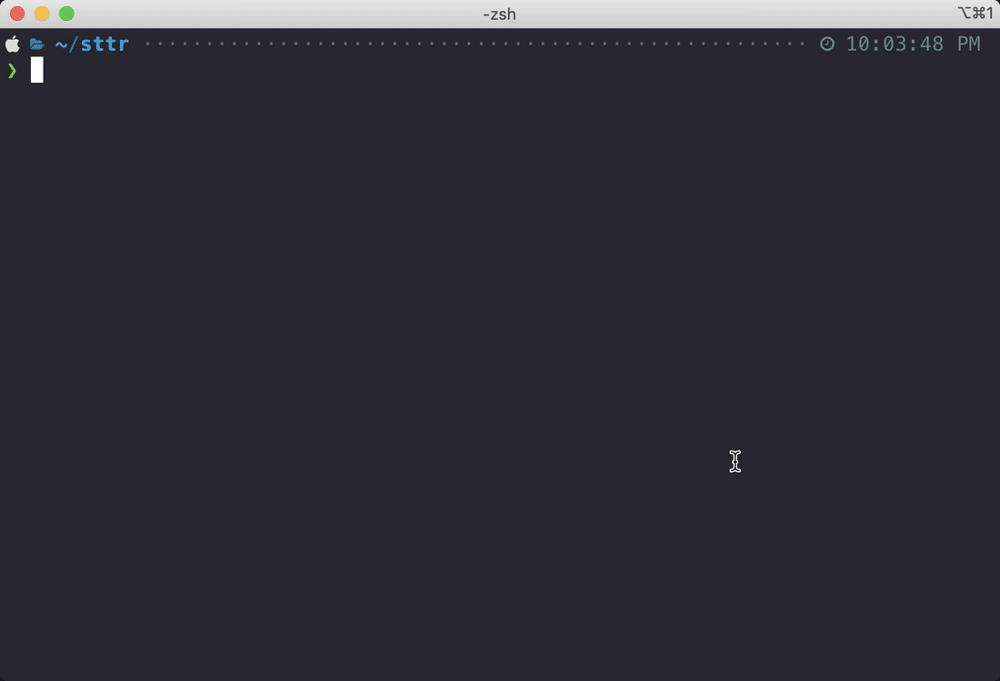

# sttr

[Website](https://abhimanyu003.github.io/sttr/)
| [Install](https://github.com/abhimanyu003/sttr#battery-installation)
| [Getting Started](https://github.com/abhimanyu003/sttr#books-guide)
| [CLI Reference](https://abhimanyu003.github.io/sttr/cli/sttr/)
| [Source Code](https://github.com/abhimanyu003/sttr)

`sttr` is command line software that allows you to quickly run various transformation operations on the string.

```go
// With input prompt
sttr

// Direct input
sttr md5 "Hello World"

// File input
sttr md5 file.text
sttr base64-encode image.jpg

// Reading from different processor like cat, curl, printf etc..
echo "Hello World" | sttr md5
cat file.txt | sttr md5

// Writing output to a file
sttr yaml-json file.yaml > file-output.json
```

# :movie_camera: Demo



# :battery: Installation

#### Quick install

You can run the below `curl` to install it somewhere in your PATH for easy use. Ideally it will be installed at `./bin`
folder

```sh
curl -sfL https://raw.githubusercontent.com/abhimanyu003/sttr/main/install.sh | sh
```

#### Homebrew

If you are on macOS and using Homebrew, you can install `sttr` with the following:

```go
brew tap abhimanyu003/sttr
brew install sttr
```

#### Snap

```
sudo snap install sttr
```

#### Go

```go
go install github.com/abhimanyu003/sttr@latest
```

#### Manually

Download the pre-compiled binaries from the [Release!](https://github.com/abhimanyu003/sttr/releases) page and copy them
to the desired location.

# :books: Guide

* After installation simply run `sttr` command.

```go
// For interactive menu
sttr
// Provide your input
// Press two enter to open operation menu
// Press `/` to filter various operations.
// Can also press UP-Down arrows select various operations.
```

* Working with help.

```go
sttr -h

// Example
sttr zeropad -h
sttr md5 -h
```

* Working with files input.

```go
sttr {command-name} {filename}

sttr base64-encode image.jpg
sttr md5 file.txt
sttr md-html Readme.md
```

* Writing output to file.

```go
sttr yaml-json file.yaml > file-output.json
```

* Taking input from other command.

```go
curl https: //jsonplaceholder.typicode.com/users | sttr json-yaml
```

* Chaining the different processor.

```go
sttr md5 hello | sttr base64-encode

echo "Hello World" | sttr base64-encode | sttr md5
```

# :boom: Supported Operations

#### Encode/Decode

- [x] **ascii85-encode** - Encode your text to ascii85
- [x] **ascii85-decode** - Decode your ascii85 text
- [x] **base32-decode** - Decode your base32 text
- [x] **base32-encode** - Encode your text to Base32
- [x] **base64-decode** - Decode your base64 text
- [x] **base64-encode** - Encode your text to Base64
- [x] **base85-encode** - Encode your text to base85
- [x] **base85-decode** - Decode your base85 text
- [x] **base64url-decode** - Decode your base64 url
- [x] **base64url-encode** - Encode your text to url
- [x] **html-decode** - Unescape your HTML
- [x] **html-encode** - Escape your HTML
- [x] **rot13-encode** - Encode your text to ROT13
- [x] **url-decode** - Decode URL entities
- [x] **url-encode** - Encode URL entities

#### Hash

- [x] **bcrypt** - Get the Bcrypt hash of your text
- [x] **md5** - Get the MD5 checksum of your text
- [x] **sha1** - Get the SHA1 checksum of your text
- [x] **sha256** - Get the SHA256 checksum of your text
- [x] **sha512** - Get the SHA512 checksum of your text

#### String

- [x] **camel** - Transform your text to CamelCase
- [x] **kebab** - Transform your text to kebab-case
- [x] **lower** - Transform your text to lower case
- [x] **reverse** - Reverse Text ( txeT esreveR )
- [x] **slug** - Transform your text to slug-case
- [x] **snake** - Transform your text to snake_case
- [x] **title** - Transform your text to Title Case
- [x] **upper** - Transform your text to UPPER CASE

#### Lines

- [x] **count-lines** - Count the number of lines in your text
- [x] **reverse-lines** - Reverse lines
- [x] **shuffle-lines** - Shuffle lines randomly
- [x] **sort-lines** - Sort lines alphabetically
- [x] **unique-lines** - Get unique lines from list

#### Count

- [x] **count-chars** - Find the length of your text (including spaces)
- [x] **count-lines** - Count the number of lines in your text
- [x] **count-words** - Count the number of words in your text

#### RGB/Hex

- [x] **hex-rgb** - Convert a #hex-color code to RGB
- [x] **hex-encode** - Encode your text Hex
- [x] **hex-decode** - Convert Hexadecimal to String

#### JSON

- [x] **json** - Format your text as JSON
- [x] **json-escape** - JSON Escape
- [x] **json-unescape** - JSON Unescape
- [x] **json-yaml** - Convert JSON to YAML text
- [x] **json-msgpack** - Convert JSON to MSGPACK
- [x] **msgpack-json** - Convert MSGPACK to JSON

#### YAML

- [x] **yaml-json** - Convert YAML to JSON text

#### Markdown

- [x] **markdown-html** - Convert Markdown to HTML

#### Extract

- [x] **extract-emails** - Extract emails from given text
- [x] **extract-ip** - Extract IPv4 and IPv6 from your text

#### Other

- [x] **completion** - generate the autocompletion script for the specified shell
- [x] **interactive** - Use sttr in interactive mode
- [x] **version** - Print the version of sttr
- [x] **zeropad** - Pad a number with zeros
- [x] **and adding more....**

# Contribution

This project welcomes your PR and issues. For example, refactoring, adding features, correcting English, etc. 

A quick development guide can be found on. [Developer-Guides](https://github.com/abhimanyu003/sttr/wiki/Developer-Guides) wiki page.

If you need any help, you can contact me on [Twitter](https://twitter.com/abhimanyu003).

Thanks to all the people who already contributed!

<a href="https://github.com/abhimanyu003/sttr/graphs/contributors">
  
</a>

# License

[MIT](./LICENSE)
